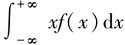

```{r setup, include=FALSE}
knitr::opts_chunk$set(echo = TRUE,fig.height=4,fig.width=8)
library(tidyverse)
library(kableExtra)
library(gridExtra) 
library(ggthemes)
library(purrr)
require(graphics)
library(RColorBrewer)
library(gganimate)
library(rticles)


source("~/LearningNotes_R/theme_hkw_custom.R") #导入自定义ggtheme


```


## 统计学

## 两种基本思维

两个思维对理解统计学方法非常重要：*极限*和*抽样*。

### 极限
  世界是无穷无尽限的，比如全世界所有的人体重、身高的数据，即使足够的人手和资源为每个人测量，也会因为生老病死而无法做到。
 数学家解决这个问题的办法是利用微积分的思维把统计到的数据规律推广到*极限*，因此，统计中的基本定理和公式是以积分求极限的方式来推导和证明的，最常见的描绘是"当n趋向于无穷时..."

### 抽样

 通过有代表性的部分——**样本**来描绘数据的总体特性，由部分到全貌，由个别到一般，是统计学解决问题的基本逻辑，也是其价值所在。
 我们能统计到的数据是部分，而我们描绘是总体的特性，我们用来解决问题的也是总体的特性。
 
## 数学基本概念

基础概念是逻辑推理的基础，定义了逻辑的范畴。在我们即要描绘的正态分布这个最重要的数据分布形态中，最重要的基本概念有三个，*级数*、*均值*、*概率密度*。

### 级数

如果给定一个数列u1,u2,u3,…,un,…，则表达式u1＋u2＋u3＋…＋un＋… 叫作（常数项）无穷级数，简称（常数项）级数，记作, 即
其中u1,u2,u3,…,un,…叫作级数的项，u1叫作级数的首项，级数的第n项un叫作级数的通项或一般项.

### 概率密度（Probability Density）

*定义*：对于随机变量X的分布函数F(x)，如果存在非负可积函数f(x)，使得对任意实数x，有，则X为连续型随机变量，称f(x)为X的概率密度函数，简称为概率密度。


*几何意义*：随机变量落在一个区间内的概率与这个区间大小的比值在区间大小趋向于0时的极限。
指事件随机发生的几率。概率密度等于一段区间（事件的取值范围）的概率除以该段区间的长度，它的值是非负的，可以很大也可以很小。

## 统计学概念

### 均值

  更正式的名称叫数学期望，对于离散型变量和连续型变量是分别定义的，
  
  +  *定义1：* 设X是离散型的随机变量，其分布律为 P（X=xi）=pi，i=1，2，…．如果级数  绝对收敛，则称为离散型随机变量X的数学期望，也称作期望或均值。
  
  +  *定义2：* 设X是连续型随机变量，其密度函数为f（x）．如果广义积分 
绝对收敛，则称为连续型随机变量X的数学期望，也称作期望或均值．

*抽样思维：* 这里要强调一下的是，统计学中*均值*的概念指的样本所代表的那个总体的均值，是用极限的方法穷举所有可能得出的值，而不是样本的算术平均，为了概念上的严谨，专业场合*数学期望*这个称谓更常用。

### 方差

  方差是一个均值（数学期望），它是一个特殊级数（无穷个项的均值，这个。


# 正态分布

## 通用变量

```{r variable,echo=FALSE,warning=FALSE}

## 通用变量

set.seed(2025)
  m <- 10000
  mean <- 0
  mean0 <- 0
  sd <- 1
  sd10 <-1
  sd08 <- 0.8
  sd12 <- 1.2
  
  prob08<- 0.8
  y_limits <- c(0,0.62)
  y_breaks <- c(0,0.2,0.4,0.6)
  x_tol <- 2.8*0.8 # 2.8*sd
  x_limits <- c(-5*sd*0.8,5*sd*0.8) +mean0
  x_limits4 <- c(-4.5*sd*0.8,4.5*sd*0.8) +mean0
  x_limits5 <- c(-5.5*sd*0.8,5.5*sd*0.8) +mean0
  x_limits6 <- c(-6.5*sd*0.8,6.5*sd*0.8) +mean0
  x_break <- c(-4*sd*0.8,-3*sd*0.8,-2*sd*0.8,-sd*0.8,mean,sd*0.8,2*sd*0.8,3*sd*0.8,4*sd*0.8) +mean
  x_breaks3 <- seq(-3,3,1)+mean0
  x_breaks4 <- seq(-4,4,1)+mean0
  x_breaks6 <- seq(-6,6,1)+mean0
  
  x_breaks3p <- seq(-3,3,1)*prob08+mean0
  x_breaks4p <- seq(-4,4,1)*prob08+mean0
  x_breaks6p <- seq(-6,6,1)*prob08+mean0
  
  x_labls <- expression(-4*sigma,-3*sigma,-2*sigma,-1*sigma,0,1*sigma,2*sigma,3*sigma,4*sigma)
  x_labels3 <- expression(-3*sigma,-2*sigma,-1*sigma,0,1*sigma,2*sigma,3*sigma)
  x_labels4 <- expression(-4*sigma,-3*sigma,-2*sigma,-1*sigma,0,1*sigma,2*sigma,3*sigma,4*sigma)
  x_labels6 <- expression(-6*sigma,-5*sigma,-4*sigma,-3*sigma,-2*sigma,-1*sigma,0,
                          1*sigma,2*sigma,3*sigma,4*sigma,5*sigma,6*sigma)
  
  color_area <- c("#9AD9E6","#C7EAF1","#E4F5F8","#FF9999","#CC0000","#A50021")
  
  x001 <- seq(-1,1,0.0001)*6.1*sd
  
```

## 正态分布数据的分布图示

```{r dnorm_sigma,echo=FALSE,warning=FALSE}
#渐浅的灰，"#BFBFBF","#D9D9D9","#F2F2F2"
  
 #  data17 <- rnorm(100000,mean,sd)
 # 
 #  df17 <- data.frame(x = data17,d= dnorm(data17,mean,sd))
 # p17 <- ggplot(df17,aes(x=x,y=d)) +
 #   labs(title=expression(paste("正态分布6",sigma,"区间"))) +
 #   geom_line(color = "#186779") +
 #   geom_area(fill=color_area[1]) +
 #   scale_x_continuous(limits = x_limits,breaks = x_breaks3,labels = x_labels3)+
 #   geom_segment(aes(x=0,y=0,xend=0,yend=0.4))+
 #    geom_area(data =subset(df17,x< -3*sd*0.8),aes(x=x,y=d),fill=color_area[2]) +
 #    geom_area(data =subset(df17,x> 3*sd*0.8),aes(x=x,y=d),fill=color_area[2])+
 #   theme_hkw()
 # 
 #  p17

  df00 <- data.frame(x=x001,density=dnorm(x001,mean,sd10),qc_level= "sd10",color = "blue")
  p0 <- ggplot(df00,aes(x=x,y=density)) +
    labs(title=expression(paste("正态分布6",sigma,"区间"))) + 
   geom_line(color = "#186779") +  
   geom_area(fill=color_area[1]) + 
   scale_x_continuous(limits = x_limits,breaks = x_breaks3,labels = x_labels3)+
   geom_segment(aes(x=0,y=0,xend=0,yend=0.4))+
    geom_area(data =subset(df00,x< -3*sd*0.8),aes(x=x,y=density),fill=color_area[2]) +
    geom_area(data =subset(df00,x> 3*sd*0.8),aes(x=x,y=density),fill=color_area[2])+
   theme_hkw() 

  p0
  
  #grid.arrange(p0,p17,nrow = 2,ncol = 1)
  

```
它是数据统计的一种分布趋势的规律，这个规律是这样的。
频数柱状图
密度柱状图


## 从频度分布到概率密度曲线

```{r histgram,echo=FALSE,warning=FALSE,fig.height=12}
set.seed(2028)

  data1 <- rnorm(500,mean,sd)
  df1 <- data.frame(x = data1)
  kable(head(df1,10),caption = "10个数据")
  
  p1 <- ggplot(df1,aes(x=x)) + 
    geom_histogram(color ="#17C2B2",fill=color_area[1],binwidth = 0.3) + 
    labs(title= "100个数据的频数分布",x="取值区间",y="数值个数")  +
    scale_x_continuous(limits = x_limits6,breaks = x_breaks4)+
    theme_hkw()
  
  p21 <- ggplot(df1,aes(x=x)) + 
    geom_histogram(aes(y=..density..),color ="#17C2B2",fill=color_area[1],binwidth = 0.3) + 
    labs(title= "100个数据的频数分布",x="取值区间",y="数值个数")  +
    scale_x_continuous(limits = x_limits6,breaks = x_breaks4)+
    theme_hkw()

data2 <- rnorm(1000,mean,sd)
  df2 <- data.frame(x = data2)
  p2 <- ggplot(df2,aes(x=x)) + 
    geom_histogram(color ="#17C2B2",fill=color_area[1],binwidth =0.3) +
    labs(title="1000个数据的频数分布",x="取值区间",y="数值个数")  +
    scale_x_continuous(limits = x_limits6,breaks = x_breaks4)+
  theme_hkw()
  
  p22 <- ggplot(df2,aes(x=x)) + 
    geom_histogram(aes(y=..density..),color ="#17C2B2",fill=color_area[1],binwidth =0.3) +
    labs(title="1000个数据的频数分布",x="取值区间",y="数值个数")  +
    scale_x_continuous(limits = x_limits6,breaks = x_breaks4)+
  theme_hkw()
  
  data3 <- rnorm(10000,mean,sd)
  df3 <- data.frame(x = data3)
  p3 <- ggplot(df3,aes(x=x)) + 
    geom_histogram(color ="#17C2B2",fill=color_area[1],binwidth = 0.1) +
    labs(title="10000个数据的频数分布",x="取值区间",y="数值个数")  +
    scale_x_continuous(limits = x_limits6,breaks = x_breaks4)+
  theme_hkw()
  
  p23 <- ggplot(df3,aes(x=x)) + 
    geom_histogram(aes(y=..density..),color ="#17C2B2",fill=color_area[1],binwidth = 0.1) +
    labs(title="10000个数据的频数分布")  +
    scale_x_continuous(limits = x_limits6,breaks = x_breaks4)+
  theme_hkw()
 
               
  data4 <- rnorm(100000,mean,sd)
  df4 <- data.frame(x = data4,density = dnorm(data4,mean,sd))             
  p4 <- ggplot(df4,aes(x=x)) + 
    geom_histogram(color ="#17C2B2",fill=color_area[1],binwidth = 0.033)  +
    labs(title="100000个正态分布数据的频数分布图",x="取值区间",y="数值个数") +
    scale_x_continuous(limits = x_limits6,breaks = x_breaks4)+
    theme_hkw()
  
   p24 <- ggplot(df4,aes(x=x)) + 
    geom_histogram(aes(y=..density..),color ="#17C2B2",fill=color_area[1],binwidth = 0.033)  +
    labs(title="100000个正态分布数据的频数分布图",x="取值区间",y="数值个数") +
    scale_x_continuous(limits = x_limits6,breaks = x_breaks4)+
    theme_hkw()
```

### 数据一览

```{r histgram_data,echo=FALSE}
    str(df4)
   summary(df4)
   
```

### 排列输出

```{r histgram_grid_p,echo=FALSE,warning=FALSE,fig.height=12}
grid.arrange(p2,p3,p4,nrow=3,ncol=1)
  grid.arrange(p22,p23,p24,nrow = 3,ncol=1)
  
```


## 概率密度柱状态图叠加概率密度曲线


```{r hist_line,echo=FALSE,warning=FALSE,fig.height =12}
# 
#   x_limits <- c(-7*sd*0.8,7*sd*0.8)
#   x_break <- c(-6*sd*0.8,-5*sd*0.8,-4*sd*0.8,-3*sd*0.8,-2*sd*0.8,-sd*0.8,mean,sd*0.8,2*sd*0.8,3*sd*0.8,4*sd*0.8,5*sd*0.8,6*sd*0.8)
#   x_labls<- expression(-6*sigma,-5*sigma,-4*sigma,-3*sigma,-2*sigma,-1*sigma,0,1*sigma,2*sigma,3*sigma,4*sigma,5*sigma,6*sigma)

p5 <- ggplot(df4,aes(x=x,y=density)) + 
    geom_histogram(aes(y=..density..),color ="#17C2B2",fill=color_area[1],binwidth = 0.06)  +
    labs(title=expression(paste("10万个正态分布数值的概率密度柱状图叠加概率密度曲线在6个",sigma,"区间的分布")),bold = TRUE ) +
    scale_x_continuous(limits = x_limits6,breaks = x_breaks6,labels = x_labels6)+
    theme_hkw() +
  geom_line(color = "#12414A") 
 
 df6 <- df4
 p6 <- ggplot(df6,aes(x=x,y=density)) + 
    labs(title=expression(paste("10万个正态分布数值的概率密度曲线在6个",sigma,"区间的分布"))) + 
   geom_line(color = "#12414A") +    
   geom_area(fill=color_area[1]) + 
   scale_x_continuous(limits = x_limits6,breaks = x_breaks6,labels = x_labels6)+
   theme_hkw()

 
 #p7 <- p6 + geom_vline(aes(xintercept=0),color = "#12414A")
 
   p37 <- ggplot(df00,aes(x=x,y=density)) +
    labs(title=expression(paste("正态分布6",sigma,"区间"))) + 
   geom_line(color = "#186779") +  
   geom_area(fill=color_area[1]) + 
   scale_x_continuous(limits = x_limits6,breaks = x_breaks6,labels = x_labels6)+
   geom_segment(aes(x=0,y=0,xend=0,yend=0.4))+
   theme_hkw() 

 
 grid.arrange(p5,p6,p37,nrow=3,ncol=1)
 
```

## 正态分布的标准差sigma


```{r hist_area}
p8 <- p37 +
    geom_area(data =subset(df00,x< -sd*0.8),aes(x=x,y=density),fill=color_area[2]) +
    geom_area(data =subset(df00,x>sd*0.8),aes(x=x,y=density),fill=color_area[2])
  
  p9 <- p8 +
    geom_area(data =subset(df00,x< -2*sd*0.8),aes(x=x,y=density),fill=color_area[3]) +
    geom_area(data =subset(df00,x> 2*sd*0.8),aes(x=x,y=density),fill=color_area[3])

  p10 <- p9 +
    geom_area(data =subset(df00,x< -3*sd*0.8),aes(x=x,y=density),fill=color_area[4]) +
    geom_area(data =subset(df00,x> 3*sd*0.8),aes(x=x,y=density),fill=color_area[4])

  
  # p11<- p10 +
  #   geom_area(data =subset(df00,x< -4*sd*0.8),aes(x=x,y=density),fill=color_area[5]) +
  #   geom_area(data =subset(df00,x> 4*sd*0.8),aes(x=x,y=density),fill=color_area[5])
  # 
  # p12 <- p11 + 
  #   geom_area(data =subset(df00,x< -5*sd*0.8),aes(x=x,y=density),fill=color_area[6]) +
  #   geom_area(data =subset(df00,x> 5*sd*0.8),aes(x=x,y=density),fill=color_area[6])
  # 

  
  p11<- p10 + 
    geom_segment(aes(x=-mean+x_tol,y=0,xend=mean+x_tol,yend=0.2))+
    geom_segment(aes(x=-mean-x_tol,y=0,xend=mean-x_tol,yend=0.2))
  
   p11

```


```{r hist_area_arrange,fig.height=8,fig.width=18}
  
  grid.arrange(p8,p9,p10,p11, nrow = 2, ncol= 2)
  
```

## 标准正态分布的6sigma图完整版

```{r hist_6sigma}

  

  
  p17 <- ggplot(df00,aes(x=x,y=density)) + 
   labs(title=expression(paste("正态分布6",sigma,"区间"))) + 
    geom_line(color = color_area[1]) +  
   geom_area(fill=color_area[1]) + 
   scale_x_continuous(limits = x_limits,breaks = x_breaks4,labels = x_labels4)+
   scale_y_continuous(limits = c(0,0.8),breaks = c(0,0.2,0.4,0.6,0.8))+
    geom_area(data =subset(df00,x< -sd10*0.8),aes(x=x,y=density),fill=color_area[2]) +
    geom_area(data =subset(df00,x> sd10*0.8),aes(x=x,y=density),fill=color_area[2])+
    geom_area(data =subset(df00,x< -2*sd10*0.8),aes(x=x,y=density),fill=color_area[3]) +
    geom_area(data =subset(df00,x> 2*sd10*0.8),aes(x=x,y=density),fill=color_area[3])+
    geom_area(data =subset(df00,x< -3*sd10*0.8),aes(x=x,y=density),fill=color_area[4]) +
    geom_area(data =subset(df00,x> 3*sd10*0.8),aes(x=x,y=density),fill=color_area[4])+
    geom_segment(aes(x=-0,y=0,xend=0,yend=dnorm(0,mean,sd10)))+
    geom_segment(aes(x=-mean+x_tol,y=0,xend=mean+x_tol,yend=0.3))+
    geom_segment(aes(x=-mean-x_tol,y=0,xend=mean-x_tol,yend=0.3))+
   theme_hkw()   
  p17
  


```


## 2sigma提升到3.1sigma

```{r echo=FALSE,fig.height=12}

  df08 <- data.frame(x=x001,density = dnorm(x001,mean,sd08),qc_level= "sd08",color="green")
  df12 <- data.frame(x=x001,density = dnorm(x001,mean,sd12),qc_level= "sd12",color="red")

  p210 <- ggplot(df00,aes(x=x,y=density)) + 
   labs(title=expression(paste("正态分布6",sigma,"区间"))) + 
    geom_line(color = color_area[1]) +  
   geom_area(fill=color_area[1]) + 
   scale_x_continuous(limits = x_limits6,breaks = x_breaks6)+
   scale_y_continuous(limits = y_limits,breaks = y_breaks)+
       geom_area(data =subset(df00,x< -sd10*0.8),aes(x=x,y=density),fill=color_area[2]) +
    geom_area(data =subset(df00,x>sd10*0.8),aes(x=x,y=density),fill=color_area[2])+
    geom_area(data =subset(df00,x< -2*sd10*0.8),aes(x=x,y=density),fill=color_area[3]) +
    geom_area(data =subset(df00,x> 2*sd10*0.8),aes(x=x,y=density),fill=color_area[3])+
    geom_area(data =subset(df00,x< -3*sd10*0.8),aes(x=x,y=density),fill=color_area[4]) +
    geom_area(data =subset(df00,x> 3*sd10*0.8),aes(x=x,y=density),fill=color_area[4])+
    geom_area(data =subset(df00,x< -4*sd*0.8),aes(x=x,y=density),fill=color_area[5]) +
    geom_area(data =subset(df00,x> 4*sd10*0.8),aes(x=x,y=density),fill=color_area[5]) +
    geom_area(data =subset(df00,x< -5*sd10*0.8),aes(x=x,y=density),fill=color_area[6]) +
    geom_area(data =subset(df00,x> 5*sd10*0.8),aes(x=x,y=density),fill=color_area[6])+ 
    geom_segment(aes(x=-0,y=0,xend=0,yend=dnorm(0,mean,sd10)))+
    geom_segment(aes(x=-mean+x_tol,y=0,xend=mean+x_tol,yend=0.3))+
    geom_segment(aes(x=-mean-x_tol,y=0,xend=mean-x_tol,yend=0.3))+
   theme_hkw()   
  
  
  p208 <- ggplot(df08,aes(x=x,y=density)) + 
   labs(title=expression(paste("正态分布6",sigma,"区间"))) + geom_line(color = color_area[1]) +  
   geom_area(fill=color_area[1]) + 
   scale_x_continuous(limits = x_limits6,breaks = x_breaks6)+
   scale_y_continuous(limits = y_limits,breaks = y_breaks)+
    geom_area(data =subset(df08,x< -sd08*0.8),aes(x=x,y=density),fill=color_area[2]) +
    geom_area(data =subset(df08,x> sd08*0.8),aes(x=x,y=density),fill=color_area[2])+
    geom_area(data =subset(df08,x< -2*sd08*0.8),aes(x=x,y=density),fill=color_area[3]) +
    geom_area(data =subset(df08,x> 2*sd08*0.8),aes(x=x,y=density),fill=color_area[3])+
    geom_area(data =subset(df08,x< -3*sd08*0.8),aes(x=x,y=density),fill=color_area[4]) +
    geom_area(data =subset(df08,x> 3*sd08*0.8),aes(x=x,y=density),fill=color_area[4])+
    geom_segment(aes(x=-0,y=0,xend=0,yend=dnorm(0,mean,sd08)))+
    geom_segment(aes(x=-mean+x_tol,y=0,xend=mean+x_tol,yend=0.3))+
    geom_segment(aes(x=-mean-x_tol,y=0,xend=mean-x_tol,yend=0.3))+
   theme_hkw()  
  
  p212 <- ggplot(df12,aes(x=x,y=density)) + 
   labs(title=expression(paste("p19正态分布6",sigma,"区间"))) + geom_line(color = color_area[1]) +  
   geom_area(fill=color_area[1]) + 
   scale_x_continuous(limits = x_limits6,breaks = x_breaks6)+
   scale_y_continuous(limits = y_limits,breaks = y_breaks)+
    geom_area(data =subset(df12,x< -sd12*0.8),aes(x=x,y=density),fill=color_area[2]) +
    geom_area(data =subset(df12,x> sd12*0.8),aes(x=x,y=density),fill=color_area[2])+
    geom_area(data =subset(df12,x< -2*sd12*0.8),aes(x=x,y=density),fill=color_area[3]) +
    geom_area(data =subset(df12,x> 2*sd12*0.8),aes(x=x,y=density),fill=color_area[3])+
    geom_area(data =subset(df12,x< -3*sd12*0.8),aes(x=x,y=density),fill=color_area[4]) +
    geom_area(data =subset(df12,x> 3*sd12*0.8),aes(x=x,y=density),fill=color_area[4])+
    geom_segment(aes(x=-0,y=0,xend=0,yend=dnorm(0,mean,sd12)))+
    geom_segment(aes(x=-mean+x_tol,y=0,xend=mean+x_tol,yend=0.3))+
    geom_segment(aes(x=-mean-x_tol,y=0,xend=mean-x_tol,yend=0.3))+
   theme_hkw() 
  
    grid.arrange(p212,p210,p208,nrow =3,ncol=1)
```


## 3条密度曲线分布图

```{r dnorm_3}

  
 df20 <- bind_rows(df00,df08,df12)
  
  p220 <- ggplot(df20,aes(x=x,y=density),group= qc_level) + 
  labs(title="标准差分别为0.8、1.0、1.2的正态分布曲线") + 
  geom_line(aes(color =color))  +  
  scale_x_continuous(limits = x_limits6,breaks = seq(-6,6,2))+
  scale_y_continuous(limits = y_limits,breaks =y_breaks)+
    geom_segment(aes(x=-0,y=0,xend=0,yend=dnorm(0,mean,sd08)))+
  theme_hkw()   
  
  p221 <- p220 +
        geom_segment(aes(x=3*sd12*0.8,y=0,xend=3*sd12*0.8,yend=dnorm(0,mean,sd12)),color = "red")+
    geom_segment(aes(x=-3*sd12*0.8,y=0,xend=-3*sd12*0.8,yend=dnorm(0,mean,sd12)),color = "red")
 
    
  p222 <- p221 +
     geom_segment(aes(x=3*sd10*0.8,y=0,xend=3*sd10*0.8,yend=dnorm(0,mean,sd10)),color = "blue")+
    geom_segment(aes(x=-3*sd10*0.8,y=0,xend=-3*sd10*0.8,yend=dnorm(0,mean,sd10)),color = "blue")
  
  p223 <- p222 +
    geom_segment(aes(x=3*sd08*0.8,y=0,xend=3*sd08*0.8,yend=dnorm(0,mean,sd08)),color = "green")+
    geom_segment(aes(x=-3*sd08*0.8,y=0,xend=-3*sd08*0.8,yend=dnorm(0,mean,sd08)),color = "green")
  
p220
p221
p222
p223
if(FALSE){
  
  df21 <- df20 %>% 
    bind_rows(data.frame(x=x001,density= dnorm(x001,mean= mean,sd=0.9),qc_level = "sd09"),
              data.frame(x=x001,density= dnorm(x001,mean= mean,sd=1.1),qc_level = "sd11"))

  p224 <- ggplot(df21,aes(x=x,y=density),group= qc_level) + 
  scale_x_continuous(limits = x_limits6,breaks = seq(-6,6,2))+
  scale_y_continuous(limits = y_limits,breaks =y_breaks)+
  geom_line(aes(color =qc_level))  + 
  theme_hkw()   +
      labs(title = "{closest_state}") +
    transition_states(qc_level,transition_length = 5, state_length = 1)
}

```


## 均值

某工件的一个设计尺寸是 8±0.02mm，也就是说测量值在7.98~8.02范围是合格的，超出范围是不合格。

如下数据是一个工件加工后的尺寸，

```{r echo=FALSE}

norm.data <- data.frame(x = head(data1,20),group ="第1组") 
kable(top_n(norm.data,20),format = "html",caption = "某工件的尺寸测量值x1")

summary(norm.data$x)

```

这组测量值的均值


```{r echo=FALSE}
#norm.data <- data.frame(x1=x1,d1 = dnorm(data1,8,3),sd_group="sd1",group ="第1组") 
norm.data <- norm.data %>% mutate(x_mean = mean(x))  %>% select(x,x_mean,group)
                                  
kable(norm.data,format = "html",caption = "某工件的尺寸测量值x")

```

## 方差

### 偏差

偏差反映的是某一个值与均值的偏离程度。在生产过程中，偏差超过了设定的公差标准时意味该工件的不合格。

```{r echo=FALSE}
#norm.data <- data.frame(x1=x1,d1 = dnorm(data1,8,3),sd_group="sd1",group ="第1组") 
norm.data <- norm.data %>% mutate(S = x-x_mean)  %>% select(x,x_mean,S,group)


kable(norm.data,format = "html",caption = "某工件的尺寸测量值x")

```

## 方差与标准差

```{r echo=FALSE}
#norm.data <- data.frame(x1=x1,d1 = dnorm(data1,8,3),sd_group="sd1",group ="第1组") 
norm.data <- norm.data %>% mutate(Sx2 = S*S,5) %>% select(x,x_mean,S,Sx2,group)

kable(norm.data,format = "html",caption = "某工件的尺寸测量值x")
segmax2 <-sum(norm.data$Sx2)/(nrow(norm.data)-1)
segmax2 

var <- var(norm.data$x)
var

segma <- sqrt(segmax2)
segma

sd <- sd(norm.data$x)
sd


```

这组数据的方差是 `r segmax2`，标准差是`r segma `。


## 西格玛

## R Markdown

This is an R Markdown presentation. Markdown is a simple formatting syntax for authoring HTML, PDF, and MS Word documents. For more details on using R Markdown see <http://rmarkdown.rstudio.com>.

When you click the **Knit** button a document will be generated that includes both content as well as the output of any embedded R code chunks within the document.

## Slide with Bullets

- Bullet 1
- Bullet 2
- Bullet 3

## Slide with R Output

```{r cars, echo = TRUE}
summary(cars)
```

## Slide with Plot

```{r pressure}
plot(pressure)
```

